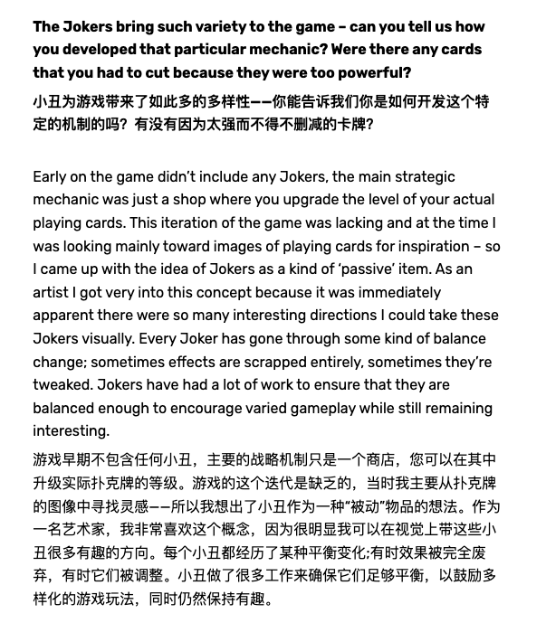
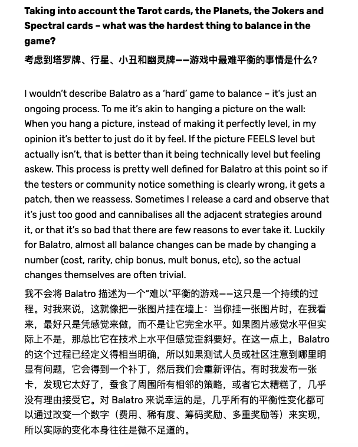
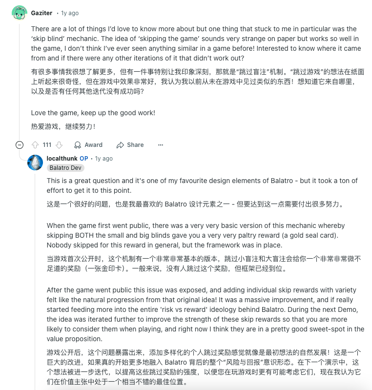

## 小丑牌简介
Balatro（中文名《小丑牌》）是一款由加拿大独立游戏开发者LocalThunk制作的，结合了德州扑克和Roguelike元素的卡牌游戏。它获得2024年独立游戏的多项大奖，创造了引人注目的销量：发行后三天内售出 25万份、10 天内售出 50万份、一个月内售出 100 万份、五个半月内售出 200 万份、截至 2025 年 2 月已售出 500 万份。
LocalThunk 在 Balatro 中的设计策略通过结构化的游戏机制、明确的目标、资源管理和鼓励玩家实验，有效地建立了清晰且可实现的获胜条件。这些元素共同创造出一种引人入胜的体验，激励玩家在动态游戏环境中追求胜利的同时发展自己的技能。
> “肉鸽游戏”是“Roguelike”游戏的中文音译，它代表了一种特定类型的游戏。
> 这类游戏的特点包括：
> - 生成随机性：每次游戏的关卡、敌人、道具等都是随机生成的，确保了每次游玩都有新鲜感。
> - 永久死亡：玩家的角色一旦在游戏中死亡，进度就会重置，玩家需要重新开始。
> - 进程单向性：游戏的存档功能通常只记录当前的游戏进度，一旦存档被读取，对应的进度就会被清空。
> - 回合制：游戏通常采用回合制，玩家在不操作角色时，游戏不会自动进行。
> - 探索与战斗：玩家需要通过探索地图新区域来获取特殊的道具和资源，并与游戏中的怪物进行战斗。

## 小丑牌的玩法总结
### 基本玩法
- 根据抽取的手牌，打出不同牌型，从而获得分数。也可以通过弃牌构建得分更高的牌型。
- 每个回合的出牌和弃牌次数有限，打出的牌获得的总分超过回合要求，则通过该回合。
- 每个底注有3个回合，打完8个底注即为通关，然后可以进入无尽模式，或返回主菜单。
### 游戏策略
- 核心目标：提升每次出牌的总分数
- 分数=筹码x倍率，小丑牌、塔罗牌、牌型都是服务于提高筹码或倍率
- 方法：
  - 通过购买、抽取，构建强有力的小丑牌组合
  - 清洗牌组+升级牌型
- 经济系统增加了策略的复杂度，需要平衡早期的过关需求和后期的买卡需求

## 小丑牌的设计拆解

| 玩法 | 体量 |
|------|-----|
| 牌组玩法(主要)  | 牌组*15 X 赌注*8 |
| 挑战玩法 | 挑战*20  |

### 游戏流程：

| 盲注选择 | 回合游戏 | 商店购买 |
|------|-----|-----|
| - 进入每个底注，会展示该底注的小盲注、大盲注和boss盲注  | - 从牌组中抽取手牌，根据手牌进行出牌或弃牌的选择 | - 小丑牌（牌包）|
| - 小盲注和大盲注可选择跳过，boss盲注必须游戏 | - 在小丑牌/游戏牌/牌型的加成下，使出牌总分超过回合目标 | - 塔罗/星球/幻灵/游戏牌（牌包）|
| - 跳过盲注时可获得标签奖励 | - 结算剩余的出/弃牌次数及优惠券，获得收入 | - 优惠券|

## 小丑牌的成功要素
### “超级概念”的缝合
- 扑克+小丑，概念足够丰富、全球共享认知
- 小丑概念下的暗喻，匹配扑克，会勾起人的好奇心
### 和谐统一的风格塑造
Balatro 采用了让人想起经典视频游戏的复古美学，利用像素艺术和迷幻视觉效果唤起玩家的怀旧之情。图形设计得充满活力和混乱，这与游戏的喜剧基调和扑克般的机制相一致。该游戏具有独特的视觉风格，包括游戏过程中采取的各种动作特效，通过感官刺激增强玩家参与度。
- CRT风格，较暗的色调选择
- 动效非常丰富，暗含爽感，比如
  - 牌包开包（盲盒感）
  - 塔罗/幻灵/星空牌的背景都不一样，很有神秘感
  - 结算动效激发爽感
- 音乐：迷幻、电子
- 牌类术语的使用，加强沉浸感
- 卡牌的加强会伴随卡面外观的变化，像多彩、负片这种视觉效果很有爽感，其实可能这种多彩皮肤也会有人愿意氪金的吧
### 简洁的目标+丰富的手段+一定的随机性
- 核心算式：分数=筹码x倍率，玩家一旦理解，就立刻上手
- 通过牌组、牌型、不同卡牌、版本等的逐渐发现和加入，极大增强了玩家的好奇心和策略丰富度
- 加强手段很丰富：
  - 搭配构建/加成小丑牌
  - 升级牌型
  - 升级/构建游戏牌组
  - 购买优惠券获得全局加成
### 延长游戏游玩寿命的设计
- 牌型、牌注、挑战模式
- 无尽模式
- 展示收藏-解锁动力
- 种子分享-追求更高的爽感
### 其他可圈可点之处
- 种子带来的社交分享性和爽感加成
- 优秀的新手引导
- 收藏、牌组卡面的致敬、多profile
- boss标签针对玩家卡组
- 游戏牌、小丑牌、消耗牌共享“牌”的概念，因此可以共享“牌型”的加成方式（而且牌型映射了实际生活中的卡片的质地感，在视觉效果上的变化很吸引人）
## 关于平衡性和数值设计
1. 以下问题，从开发策划的角度去反推当时LocalThunk为什么如此设计，可能会有一点收获？
- 消耗牌中为什么要区分塔罗牌、幻灵牌的层级设计
- 塔罗牌、幻灵牌的效果设计
- 优惠券的递进关系
- 随着底注升高，基础筹码的通胀数值设计
- 小丑牌的类型、效果设计
- 盲注/牌注等的减益效果的设计
2. 从访谈中可以看出他的一些设计理念：通过测试和调整来达到平衡状态，而不是试图从一开始就设计一个完美平衡的系统。

https://rogueliker.com/balatro-interview/
https://www.reddit.com/r/balatro/comments/1hy86g9/balatro_faq_read_before_posting/

## 小丑牌的发行&传播
- LocalThunk的独立开发storytelling
- 预发布（多次参加新品节）+先focus steam获得核心用户
- 正式发售后快速多平台上线
可参考 https://www.brothers-in-gaming.com/post/balatro

> 参考：
> 1. 从Balatro小丑牌的成功说起：浅谈rogue的核心体验与设计 https://www.gameres.com/905305.html
> 2. GameRes. "不是天才，怎么抄《小丑牌》？——从《小丑牌》简单拆解Roguelike的系统和体验." GameRes游资网. https://www.gameres.com/904990.html
> 3. 和Perplexity AI.的问答. https://www.perplexity.ai
> 4. LocalThunk在Reddit.论坛答疑. https://www.reddit.com
> 5. Balatro: How a solo developer sold more than 1M copies in one month https://www.brothers-in-gaming.com/post/balatro
> 6. Balatro Interview – LocalThunk on an “indie take on solitaire with a poker coat of paint” https://rogueliker.com/balatro-interview/
> 7. 《balatro（小丑牌）》游戏分析 https://www.kisence.com/2024/03/02/balatroxiao-chou-pai-you-xi-fen-xi/